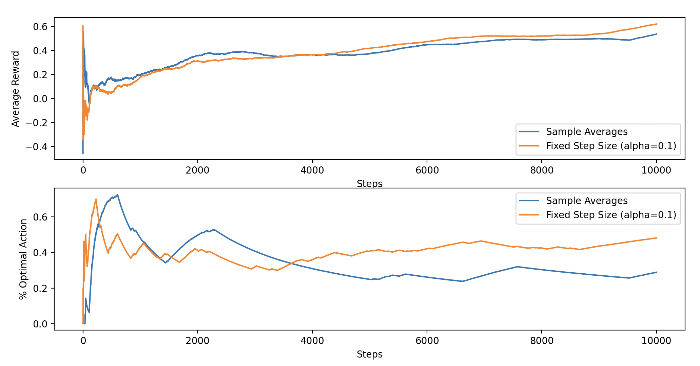

## 10 Armed Bandit
Exercise is aimed at demonstrating the difficulties faced by sample-average methods for nonstationary problems.

Plot shown above, reflects exactly as expected the behavior of both methods:

#### `Sample Average`

###### First Plot
- Initially performs well but struggles to adapt to the changing environment.
- Over the long run, it converges to a lower average reward because it gives equal weight to all past rewards, making it slower to adjust to nonstationary.

##### Second Plot
- Starts with a high percentage of optimal actions (likely due to exploration or initial luck), but its performance degrades over time as it struggles to adapt.
- The pecentage optimal action remains relatively low, reflecting its inability to respond quickly to changes in the optimal action.

#### `Fixed Step Size`

###### First Plot
- alpha = 0.1
- Adujsts faster to changes in the reward distribution, resulting in better performance in the nonstationary environment.
- Eventually surpasses the sample averages method and continues to improve.

###### Second Plot
- Quickly adapts and maintains a higher percentage of optimal actions as it prioritizes recent rewards.
- Its line trends upward over time, indicating that it learns to exploit the optimal action more consistently.

### Summary
- The difficulties sample-average methods face in nonstationary problems
    - The sample averages method gives equal weight to all past rewards, which slows its ability to adapt to changes in the true values q*(a).
- The advantage of using a fixed step-size method (alpha = 0.1)
    - The fixed step-size method adjusts faster by giving more weight to recent rewards, which makes it better suited for nonstationary environments.

